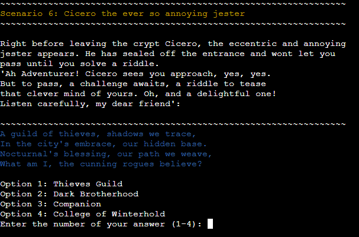

# Skyrim Word Adventure Game

## About

**Skyrim Word Adventure Game**

  
[**Live site**]()

# Table of contents
- [Features](#features)
    - [Existing Features](#existing-features)
    - [Future Features](#future-features)
- [Tools & Technologies](#tools--technologies-used)
- [Data Model](#data-model)
    - [Flowchart](#flowchart)
    - [Classes & Functions](#classes--functions)
    - [Imports](#imports)
- [Testing](#testing)
- [Deployment](#deployment)
    - [Heroku Deployment](#heroku-deployment)
    - [Local Deployment](#local-deployment)
    - [Cloning](#cloning)
    - [Forking](#forking)
- [Credits](#credits)
    - [Content](#content)
    - [Media](#media)
    - [Acknowledgements](#acknowledgements)

---

## Features

### Existing Features

- **Start**

    - First screen of the game is presenting the game name with ASCII art and telling the player to press enter to contiune.

        

- **Enter name**

    - After pressing enter on start-screen the player needs to enter a name

        

- **Welcome Message**

    - When entering a valid name and pressing enter the player gets a welcome message and a description of the game. 
        They are then prompted to press enter to contune

        

- **Scenarios**

    - After the welcome message the game will start and call in scenarion one to the player. This looks the same throughout the game except for scenario three and six where the player might die or loose depending on what option the player picked

        

- **Option picked**

    - When picking an option the screen will display what option the player picked, the name of the option and the outcome of the option made.
        The player is told to press enter to continue

        

- **Scenario three death**

    - In scenario three the player will die when picking option 2.
        A message will be displayed telling the player they died and asking the player to press enter to restart the game. Pressing enter will send the player back to the Start screen.

        

- **Scenario Six Riddle**

    - At the last option the player meets a jester called Cicero. 
        He will ask the player to solve a riddle to pass him.

        

- **Riddle Correct Answer**

    - If the correct answer is picked Cicero will tell the player that they passed and you win the game. The player is then prompted to press Enter to restart 

        

- **Riddle Wrong Answer**

    - When wrong answer is picked Cicero will laugh, let the player know the correct answer and not let the player pass. The game tells the player they lost and the player is prompted to press Enter to restart

        

- **Input validation**

| Screenshot | Notes |
| --- | --- |
|  | You need to write a name with at least three letters and letters only. |
|  | You cannot break anything by writing any special characters (!*"#%).|
|  | If you do not pick an option 1 or 2 it will tell you again to pick option 1 or 2. This will repeat with letters, special symbols etc too|
|  | You can only pick a number between 1-4 when answering the riddles |

### Future Features

- Add more riddles
- Add more scenarios and locations
- Add inventory and events further on that will end differently depending on what is in the inventory
- Add more enemies
- Add more depth to each location with different scenarios and make the controls so you pick the location to go to: "Go left to city hall or right to the local store"

---
## Tools & Technologies Used

- [Python](https://www.python.org) used as the back-end programming language.
- [Git](https://git-scm.com) used for version control. (`git add`, `git commit`, `git push`)
- [GitHub](https://github.com) used for secure online code storage.
- [Gitpod](https://gitpod.io) used as a cloud-based IDE for development.
- [Heroku](https://www.heroku.com) used for hosting the deployed back-end site.

## Data Model

### Flowchart

To follow best practice, a flowchart was created for the app's logic,
and mapped out before coding began using a free version of
[Lucidchart](https://www.lucidchart.com/pages/ER-diagram-symbols-and-meaning)

Below I made a flowchart for the scenarios and directions in the game and this was used as a guideline to know which areas and directions I needed to add.
Scenario four was later changed to The Whimsical Werewolf and scenario five was moved to become scenario six during development. Scenario five was given a new scenario.

### Functions

The primary functions used on this application are:

- `clear()`
    - Clears console.
- `prompt()`
    - Display starting message
- `section_border()`
    - Function to call border for better visuals
- `restart_program()`
    - Restarts the application.
- `scenarioOne()`
    - Displays scenario one.
- `scenarioTwo()`
    - Displays scenario two.
- `scenarioThree()`
    - Displays scenario three.
- `scenarioFour()`
    - Displays scenario four.
- `scenarioFive()`
    - Displays scenario five.
- `scenarioSix()`
    - Displays scenario six.

### Imports

I've used the following Python packages and/or external imported packages.

- `sys`: used for adding the restart program function.
- `os`: used for adding a `clear()` function.
- `colorama`: used for including color in the terminal.
- `pyfiglet`: used for including ASCII art in the terminal.
- `random`: is used for generating or manipulating random integers.

## Testing

For all testing, please refer to the [TESTING.md](TESTING.md) file.

## Deployment

Code Institute has provided a [template](https://github.com/Code-Institute-Org/python-essentials-template) to display the terminal view of this backend application in a modern web browser.
This is to improve the accessibility of the project to others.

The live deployed application can be found deployed on [Heroku]().

### Heroku Deployment

This project uses [Heroku](https://www.heroku.com), a platform as a service (PaaS) that enables developers to build, run, and operate applications entirely in the cloud.

Deployment steps are as follows, after account setup:

- Select **New** in the top-right corner of your Heroku Dashboard, and select **Create new app** from the dropdown menu.
- Your app name must be unique, and then choose a region closest to you (EU or USA), and finally, select **Create App**.
- From the new app **Settings**, click **Reveal Config Vars**, and set the value of KEY to `PORT`, and the value to `8000` then select *add*.
- If using any confidential credentials, such as CREDS.JSON, then these should be pasted in the Config Variables as well.
- Further down, to support dependencies, select **Add Buildpack**.
- The order of the buildpacks is important, select `Python` first, then `Node.js` second. (if they are not in this order, you can drag them to rearrange them)

Heroku needs two additional files in order to deploy properly.
- requirements.txt
- Procfile

You can install this project's **requirements** (where applicable) using:
- `pip3 install -r requirements.txt`

If you have your own packages that have been installed, then the requirements file needs updated using:
- `pip3 freeze --local > requirements.txt`

The **Procfile** can be created with the following command:
- `echo web: node index.js > Procfile`

For Heroku deployment, follow these steps to connect your own GitHub repository to the newly created app:

Either:
- Select **Automatic Deployment** from the Heroku app.

Or:
- In the Terminal/CLI, connect to Heroku using this command: `heroku login -i`
- Set the remote for Heroku: `heroku git:remote -a app_name` (replace *app_name* with your app name)
- After performing the standard Git `add`, `commit`, and `push` to GitHub, you can now type:
	- `git push heroku main`

The frontend terminal should now be connected and deployed to Heroku!

### Local Deployment

This project can be cloned or forked in order to make a local copy on your own system.

For either method, you will need to install any applicable packages found within the *requirements.txt* file.
- `pip3 install -r requirements.txt`.

If using any confidential credentials, such as `CREDS.json` or `env.py` data, these will need to be manually added to your own newly created project as well.

#### Cloning

You can clone the repository by following these steps:

1. Go to the [GitHub repository](https://github.com/Hujanen91/skyrim-text-adventure-PP3) 
2. Locate the Code button above the list of files and click it 
3. Select if you prefer to clone using HTTPS, SSH, or GitHub CLI and click the copy button to copy the URL to your clipboard
4. Open Git Bash or Terminal
5. Change the current working directory to the one where you want the cloned directory
6. In your IDE Terminal, type the following command to clone my repository:
	- `git clone https://github.com/Hujanen91/skyrim-text-adventure-PP3`
7. Press Enter to create your local clone.

Alternatively, if using Gitpod, you can click below to create your own workspace using this repository.

Please note that in order to directly open the project in Gitpod, you need to have the browser extension installed.
A tutorial on how to do that can be found [here](https://www.gitpod.io/docs/configure/user-settings/browser-extension).

#### Forking

By forking the GitHub Repository, we make a copy of the original repository on our GitHub account to view and/or make changes without affecting the original owner's repository.
You can fork this repository by using the following steps:

1. Log in to GitHub and locate the [GitHub Repository](https://github.com/Hujanen91/skyrim-text-adventure-PP3)
2. At the top of the Repository (not top of page) just above the "Settings" Button on the menu, locate the "Fork" Button.
3. Once clicked, you should now have a copy of the original repository in your own GitHub account!

### Local VS Deployment

As of writing this there will be no difference between the local and the deployed version on Heroku.

---

## Credits

### Content

| Source | Location | Notes |
| --- | --- | --- |
| [Colorama](https://pypi.org/project/colorama/) | PP3 terminal | Page to help add colors in the terminal |
| [ASCII](https://www.geeksforgeeks.org/python-ascii-art-using-pyfiglet-module/) | PP3 terminal | ASCII art came from this page |
| [Github](https://gist.github.com/jrosco/d01b28c2f37100bb5278) | PP3 terminal | Code for restarting the game |
| [ChatGPT](https://chat.openai.com/) | PP3 terminal | Content for Options, Answers and Riddles was generated with ChatGPT and edited to match the following scenarios. NO code was generated with the help of ChatGPT. |

### Media

For this project no external media was used for creation of this project.

### Acknowledgements

Use this space to provide attribution to any supports that helped, encouraged, or supported you throughout the development stages of this project.
A few examples have been provided below to give you some ideas.

- I would like to thank my Code Institute mentor, [Gareth Mc Girr](https://github.com/Gareth-McGirr) For his support through this project.
- I would like to thank the [Code Institute Slack community](https://code-institute-room.slack.com) for the moral support; it kept me going during periods of self doubt and imposter syndrome.

---