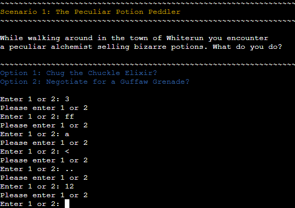
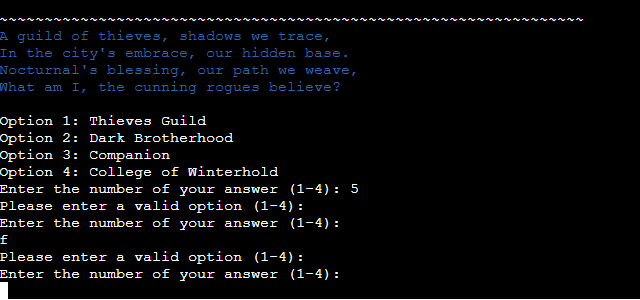

# Testing

Return back to the [README.md](README.md) file.

## Code Validation
### Python

I have used the recommended [CI Python Linter](https://pep8ci.herokuapp.com) to validate all of my Python files. 
Errors where found but it was simple errors like: 
- E501 line too long (82 > 79 characters)
- E128 continuation line under-indented for visual indent
- E305 expected 2 blank lines after class or function definition, found 0
- E275 missing whitespace after keyword
- W293 blank line contains whitespace
- W291 trailing whitespace
- W292 no newline at end of file

Small errors with simple fixes.
After fixing the errors the code validates without errors

| File | Screenshot | Notes |
| --- | --- | --- |
| run.py |  | All clear, no errors found. |
| riddles.py |  | All clear, no errors found. |

## Defensive Programming

- Users must enter a valid letter/word/string when prompted otherwise one of the things underneath will happen.

| Screenshot | Notes |
| --- | --- |
|  | You cannot enter anything other than letters for your name, it needs to be more than 3 letters and you cannot break anything by writing any special characters |
|  | You can't write 3 or higher numbers on options. You can't write letters or special characters either and they wont break anything |
|  |  You can't write letters or numbers higher than 4 when answering the riddles |

- The application has been tested numerous times to ensure that the user cannot break it by inputting the wrong commands.

## Bugs

| Screenshot | Notes |
| --- | --- |
|  |  Three lines of code in option-picking the riddles was given the "line too long" warning in the validator. I tried everything to break the lines in two and make it work and everything came back giving errors in either the terminal or in the validator. The only thing that actually worked without errors was a backward slash but instead this created a big gap between the line telling the user to pick an answer and the "(1-4)". I decided to edit the printed text to make it short enough to be on the same line to make it work and look the best it could without awkward gaps. |

---